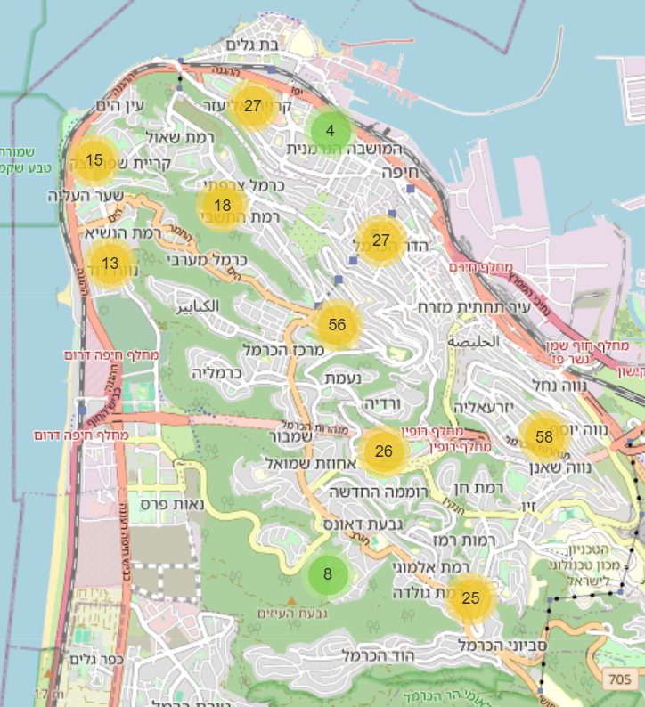

# 📊 Haifa Municipal Election Data Visualization

This project demonstrates the process of collecting, cleaning, and visualizing real-world voting data from Haifa's municipal elections.

## ✨ Live Demo
**Click the image below to view the interactive map:**

## 🚀 Technologies Used
* Python (Pandas) for data processing and cleaning.
* Folium / Leaflet.js for interactive geospatial mapping.
